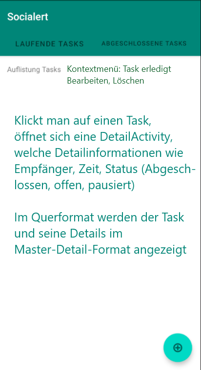
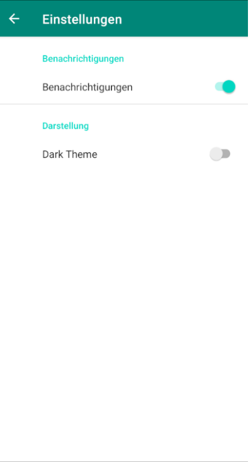
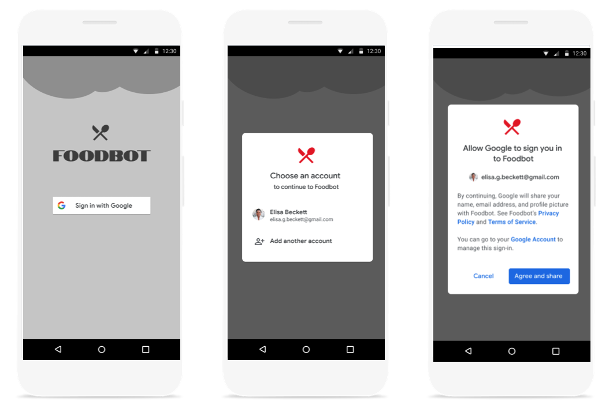
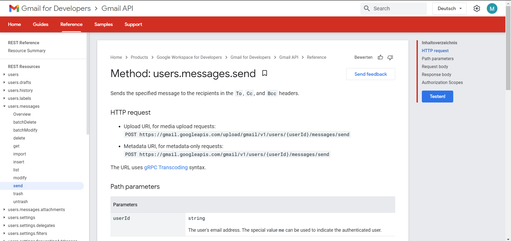

# Projektantrag

## Beschreibung

Mit der App "Socialert" ist es möglich, SMS sowie Emails automatisch zu einem bestimmten Zeitpunkt zu versenden. Um E-Mails zu versenden wird voraussichtlich die [Gmail API](https://developers.google.com/gmail/api/) verwendet. Falls noch Zeit bleibt, könnte die App auch noch mit beliebigen Funktionen erweitert werden (etwa User Login und Datensicherung in einer Firebase-Datenbank oder z.B. automatisches Versenden von WhatsApp Nachrichten).

## Grafische Mockups

     .png) 

## Anbindung an die [Neue Google-Anmelde-API](https://developers.google.com/identity/sign-in/android/sign-in-identity)

## Anbindung an die Gmail API

Wir möchten mit der [Gmail API](https://developers.google.com/gmail/api/) E-Mails versenden. Dazu verwenden wir die [messages.send](https://developers.google.com/gmail/api/v1/reference/users/messages/send)-Methode.

### Email erstellen

Die Gmail-API erfordert **MIME email messages**, die mit RFC 2822 konform und als base64url-Strings kodiert sind.

Codebeispiele unter: https://developers.google.com/gmail/api/guides/sending

### HTTP Request

Methode users.messages.send (https://developers.google.com/gmail/api/reference/rest/v1/users.messages/send)

#### Request body

The request body contains an instance of [Message](https://developers.google.com/gmail/api/reference/rest/v1/users.messages#Message).

#### Response body

If successful, the response body contains an instance of [Message](https://developers.google.com/gmail/api/reference/rest/v1/users.messages#Message).

#### Autorisierung 

API | Description | Auth | HTTPS | CORS |
|---|---|---|---|---|
| [Gmail](https://developers.google.com/gmail/api/) | Flexible, RESTful access to the user's inbox | `OAuth` | Yes | Unknown |

##### Autorisation Scopes

Wir werden folgende OAuth scope verwenden: https://www.googleapis.com/auth/gmail.send

[Verwenden von OAuth 2.0 für den Zugriff auf Google APIs](https://developers.google.com/identity/protocols/oauth2)

